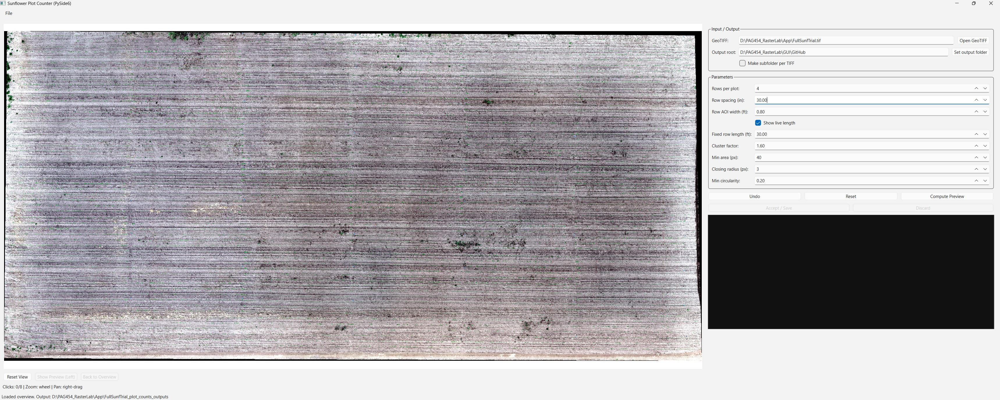
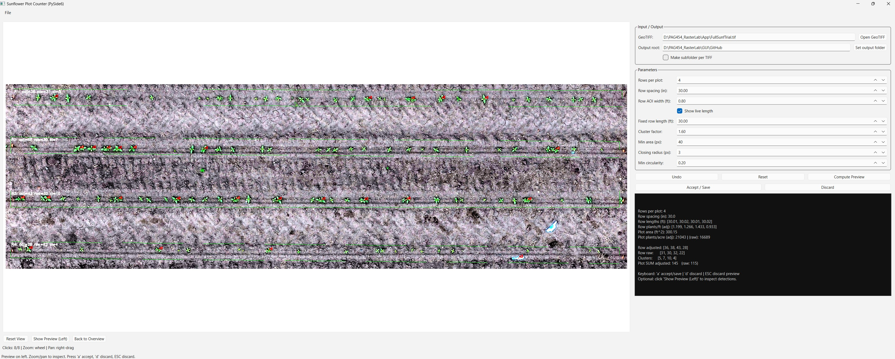

# Plot Stand Counter 🌱📊
### A Desktop GUI for Early-Season Stand Counts from RGB Orthomosaics

A lightweight **PySide6** desktop application for counting early-season crop stands (sunflower, corn, and other row crops) from large RGB GeoTIFF orthomosaics.

**Designed for:**
- Research plot trials
- Emergence assessment (e.g., ~7 DAE sunflower)
- Early corn stand counts
- High-throughput field phenotyping workflows

Optimized for large TIFFs (hundreds of MB to multi-GB) with built-in pyramid support.

---

## Features

### Plot-Based Stand Counting
- Define plots by clicking start/end points for each row
- Configurable number of rows per plot
- Configurable row spacing
- Optional fixed row length mode (e.g., standardized 20 ft strips)
- Adjustable row AOI width (ft)

### Detection & Adjustment
- Excess Green (ExG) vegetation segmentation
- Otsu thresholding inside row AOI
- Morphological cleanup
- Connected components plant detection
- Cluster/double detection heuristic
- Raw and adjusted counts

### Metrics Computed

**Per Row:**
- Row length (ft)
- Adjusted plant count
- Raw plant count
- Plants per foot

**Per Plot:**
- Total adjusted plants
- Total raw plants
- Plants per acre (adjusted + raw)
- Plot area (ft²)

### Large GeoTIFF Support
- Built-in pyramid (overview) creation
- Option to build overviews in-place or on a copy *(copy recommended)*
- Smooth zoom and pan for large mosaics

### Output Files
- `rows.csv` — row-level data
- `plots.csv` — plot-level summaries
- `annotated_overview.png`
- Individual plot images: `plot_####_raw.png` and `plot_####_annot.png`

> ⚠️ The original TIFF is **never modified** by annotations.

---

## Installation

### Requirements
- Python 3.11 or 3.12+

### Setup

Create and activate a virtual environment (recommended):

```bash
python -m venv venv
venv\Scripts\activate        # Windows
# source venv/bin/activate   # macOS/Linux
```

Install dependencies:

```bash
pip install pyside6 rasterio opencv-python numpy scikit-image
```

Or using `requirements.txt`:

```
pyside6
rasterio
opencv-python
numpy
scikit-image
```

```bash
pip install -r requirements.txt
```

---

## Running the Application

```bash
python Sunf_count_GUI.py
```

---

## Workflow

### 1. Open GeoTIFF
- Go to **File → Open GeoTIFF**
- Set your **Output Folder**

### 2. Enable Pyramids *(Recommended)*
- Check **Ensure overviews (pyramids) on open**
- Select **Build overviews on a COPY** *(recommended)*

This ensures smooth navigation on large images.

### 3. Configure Plot Parameters
- Rows per plot
- Row spacing (inches)
- Row AOI width (ft)
- Fixed row length (optional)
- Detection parameters (area, circularity, cluster factor)

### 4. Digitize a Plot
Click to define row endpoints:
- Row 1 → start, end
- Row 2 → start, end
- … After the final required click → preview computes automatically

### 5. Review & Accept

| Shortcut | Action |
|----------|--------|
| `a` | Accept & Save |
| `d` | Discard |
| `ESC` | Discard preview |

Additional controls:
- **Show Preview (Left)** — visually inspect detection
- **Mouse wheel** — zoom
- **Right-click drag** — pan
- **Reset View** — return to full overview

---

## Detection Method

### Vegetation Extraction
1. Compute Excess Green index:
   ```
   ExG = 2G - R - B
   ```
2. Otsu thresholding within the row AOI
3. Morphological closing
4. Remove small objects
5. Connected components labeling

### Cluster Adjustment
For each row:
- Compute median blob area
- If `blob_area > cluster_factor × median`:
  - Flag as cluster
  - Assign a size multiplier (capped)
- Adjusted counts sum multipliers per row

---

## Example Applications
- Sunflower emergence (~7 days after planting)
- Corn early stand counts
- Multi-row research plots
- Fixed-length sampling strips (e.g., 15 ft, 20 ft, 30 ft)

---

## Screenshots

> Place images in `docs/images/` and reference them below.

```markdown


```

---

## Output Structure

```
output_folder/
│
├── rows.csv
├── plots.csv
├── annotated_overview.png
└── plots/
    ├── plot_0001_raw.png
    ├── plot_0001_annot.png
    ├── plot_0002_raw.png
    └── ...
```

---

## Repository Structure

```
.
├── Sunf_count_GUI.py
├── README.md
├── requirements.txt
├── LICENSE
└── docs/
    └── images/
```

---

## License

Specify your license here (e.g., MIT, Apache 2.0).

---

## Citation / Acknowledgements

If you use this tool in your research, please consider citing or acknowledging the source. Contributions and issues are welcome via GitHub.
